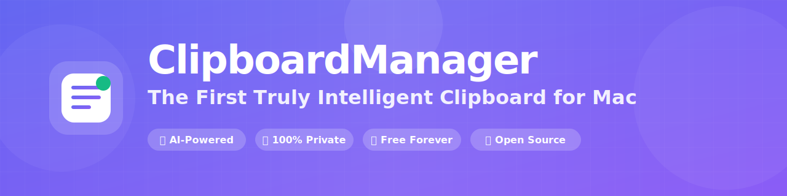
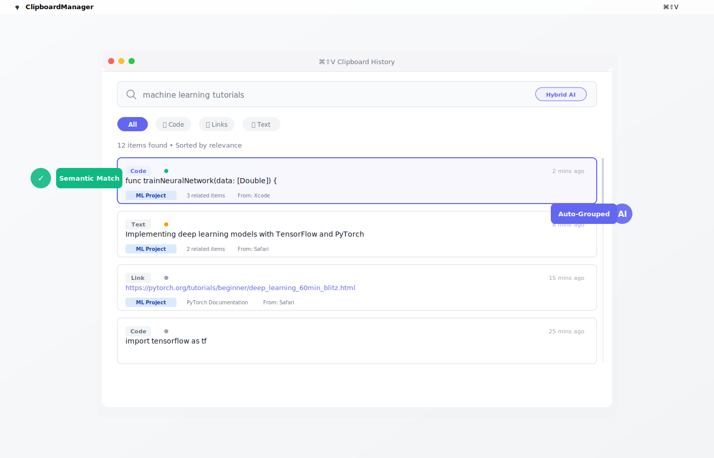
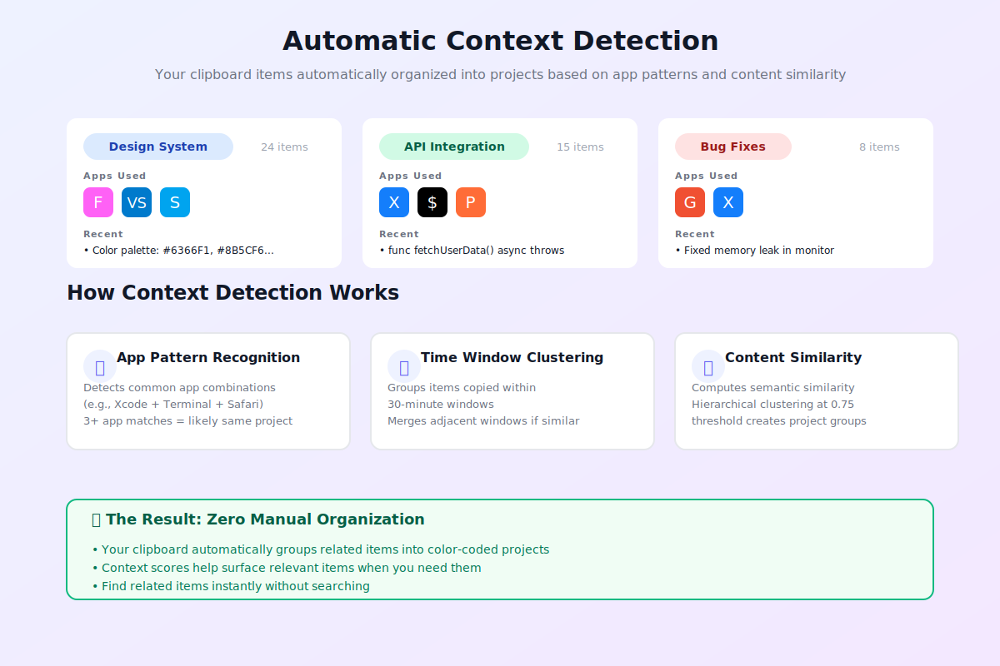

<div align="center">



# Clipso

### The First Truly Intelligent Clipboard for Mac

[](https://www.apple.com/macos/)
[](https://swift.org)
[](LICENSE)
[](https://github.com/dcrivac/Clipso/stargazers)

**[Features](#-features)** • **[Pricing](#-pricing)** • **[Download](#-installation)** • **[Demo](#-testing-semantic-search)** • **[Docs](#-architecture)** • **[Contributing](#-contributing)**

</div>

---

An intelligent macOS clipboard manager with **AI-powered semantic search** and **automatic context detection**. Find clipboard items by **meaning**, not just keywords. Never lose important clipboard content again.

<div align="center">

### ✨ What Makes It Different

| Traditional Clipboards | Clipso |
|:----------------------|:-----------------|
| 🔍 Exact keyword matching only | 🧠 **Semantic AI search** - finds by meaning |
| 📋 Manual organization & tags | 🎯 **Auto context detection** - organizes itself |
| ☁️ Cloud sync (privacy concerns) | 🔒 **100% local** - zero network requests |
| 💰 $10-15/year subscriptions | ✨ **Free + $7.99/year Premium** - 47% cheaper |

</div>

## ✨ Features

### 🧠 AI Context Engine

**Semantic Search**
- Find clipboard items by **meaning**, not just keywords
- Uses Apple's NLEmbedding for 50-dimensional sentence embeddings
- Hybrid ranking: 40% keyword + 30% semantic + 20% recency + 10% frequency
- Example: Searching "AI and machine learning" finds "neural networks", "CoreML", "TensorFlow" - even with different words

**Context Detection**
- **App Pattern Recognition**: Detects project clusters based on app usage patterns
- **Time Window Clustering**: Groups items copied within 30-minute windows
- **Content Similarity**: Finds semantically related clipboard items
- **Auto-Tagging**: Learns from manual tags to suggest project labels

**Smart Features**
- Context scores: Items relevant to your current work float to the top
- Project tags: Color-coded organization with consistent hashing
- Related items: Automatically links clipboard content from the same context
- Access tracking: Frequency-based ranking for commonly used items

### 📋 Core Features

- **Global Hotkey**: Press `Cmd+Shift+V` anywhere to access clipboard history
- **Menu Bar App**: Lightweight, always available, stays out of your way
- **Real-time Monitoring**: Captures text, images, and URLs automatically
- **Smart Categorization**: Auto-detects links, emails, code, colors, and more
- **OCR Support**: Extract text from screenshots and images
- **Encryption**: AES-256-GCM encryption for sensitive content
- **App Exclusion**: Skip monitoring from password managers
- **Duplicate Detection**: Prevents storing identical content
- **Auto Cleanup**: Configurable retention (days and item limits)

### 🎨 Enhanced UI

- **Search Modes**: Toggle between keyword, semantic, and hybrid search
- **Visual Indicators**: Context score dots (green/orange/gray)
- **Color-Coded Tags**: Automatic project tag coloring
- **Smooth Animations**: Modern, polished interface
- **Category Filters**: Quick filter by text, code, link, email, etc.
- **Item Count**: See total results at a glance

---

## 📸 See It In Action

<div align="center">


*Semantic search finds items by meaning - search for "machine learning" and find "neural networks", "TensorFlow", "deep learning"*

<br>


*Automatic context detection organizes your clipboard into color-coded projects - zero manual tagging*

<br>


*The difference AI makes - traditional keyword search vs. semantic understanding*

</div>

---

## 💎 Pricing

Clipso offers a generous free tier and an optional Premium upgrade for power users.

### Free Tier (Forever)
- ✅ Unlimited clipboard history
- ✅ Keyword search (unlimited)
- ✅ **AI semantic search (10 searches/day)**
- ✅ OCR text extraction (unlimited)
- ✅ 100% private local processing
- ✅ Global hotkey (⌘⇧V)
- ✅ Smart categorization
- ✅ Open source

### Premium ($7.99/year)
- ✅ **Everything in Free**
- ✅ **Unlimited AI semantic search**
- ✅ **Auto context detection**
- ✅ **Smart suggestions**
- ✅ iCloud sync (E2E encrypted)
- ✅ Custom snippets & templates
- ✅ Advanced search filters
- ✅ Priority support
- ✅ Early access to features

### Why Premium?
- 💰 **47% cheaper than Paste** ($7.99 vs $14.99/year)
- 🔒 **Superior privacy** - 100% local AI processing
- 🎯 **More powerful** - Context detection competitors lack
- 💎 **Fair pricing** - Support indie development

**Try Premium free for 14 days** - no credit card required.

---

## 🚀 Getting Started

### Requirements

- macOS 13.0 or later
- Xcode 15.0+ (for building from source)

### Installation

#### Option 1: Download Pre-built App (Coming Soon)

```bash
# Download from releases page
# Drag to Applications folder
# Done!
```

#### Option 2: Build from Source

1. Clone the repository:
```bash
git clone https://github.com/dcrivac/Clipso.git
cd Clipso
```

2. Open the project in Xcode:
```bash
open Clipso.xcodeproj
```

3. Build and run (⌘R)

4. Grant permissions when prompted:
   - **Accessibility**: To detect the active application
   - **Clipboard Access**: Automatic on first use

### First Launch

1. The app appears in your menu bar (📋 icon)
2. Press `Cmd+Shift+V` to open the clipboard history
3. Start copying - items are captured automatically!
4. Try semantic search: Copy ML-related items, then search "artificial intelligence"

### Quick Start Tips

💡 **Pro Tip #1**: Copy a few items about similar topics, then search for a related concept. Watch the magic happen!

💡 **Pro Tip #2**: The context detector gets smarter as you use it. Give it a day and see your work automatically organized.

💡 **Pro Tip #3**: Enable encryption in Settings for sensitive data - it's bank-level AES-256 security.

## 🧪 Testing Semantic Search

Copy these items in sequence:
```
1. "Machine learning with Swift and CoreML"
2. "Chocolate chip cookie recipe"
3. "Building neural networks with TensorFlow"
4. "Git version control commands"
```

Then search for "AI and machine learning" - items 1 and 3 will rank highest, even though they use different keywords!

## 🏗️ Architecture

### Core Components

**AI Engine** (`ClipsoApp.swift:505-1310`)
- `SemanticEngine`: NLEmbedding integration, cosine similarity
- `EmbeddingProcessor`: Background embedding generation
- `ContextDetector`: Pattern detection and clustering
- `SmartSearchEngine`: Hybrid search with multi-factor ranking

**Data Layer** (`ClipboardItemEntity`)
- Standard fields: `id`, `timestamp`, `content`, `type`, `category`
- Image support: `imageData`, `ocrText`
- Security: `encryptedContent`, `isEncrypted`
- AI fields: `embedding`, `projectTag`, `contextScore`, `relatedItemIDs`, `lastAccessedAt`, `accessCount`

**Clipboard Monitor** (`ClipsoApp.swift:1330`)
- 0.5s polling with NSPasteboard
- Main thread timer for UI responsiveness
- Automatic embedding generation on capture
- Background processing to avoid blocking

**Encryption** (`ClipsoApp.swift:215`)
- AES-256-GCM encryption
- Keychain-based key storage
- Per-item encryption toggle

### Search Algorithm

**Hybrid Ranking Formula:**
```
finalScore = (0.4 × keywordScore) +
             (0.3 × semanticScore) +
             (0.2 × recencyScore) +
             (0.1 × frequencyScore)

where:
  keywordScore = exact match ? 1.0 : (substring ? 0.5 : 0)
  semanticScore = cosineSimilarity(queryEmbedding, itemEmbedding)
  recencyScore = 1.0 / (1 + daysSinceCreated)
  frequencyScore = min(accessCount / 10, 1.0)
```

### Embedding Storage

Embeddings are stored as binary `Data`:
```swift
// Generate 50-dimensional vector
let vector: [Double] = NLEmbedding.sentenceEmbedding.vector(for: text)

// Encode to Data
let data = try JSONEncoder().encode(vector)

// Store in Core Data
item.embedding = data
```

### Context Detection Algorithms

**App Pattern Detection:**
- Extracts app sequences from last 50 items
- Finds common app combinations (e.g., Xcode + Terminal + Safari)
- 3+ app matches → likely same project
- Assigns confidence score based on frequency

**Time Window Clustering:**
- Groups items within 30-minute windows
- Merges adjacent windows if >70% similarity
- Labels windows with dominant app or content theme

**Content Similarity:**
- Computes embedding cosine similarity matrix
- Hierarchical clustering with 0.75 threshold
- Clusters become potential "projects"

## ⚙️ Configuration

### Settings

Access settings via the menu bar icon → Settings:

- **History Retention**: 1-365 days (default: 30)
- **Max Items**: 50-1000 (default: 100)
- **Encryption**: Toggle AES-256 encryption
- **OCR**: Enable/disable text extraction from images
- **Smart Paste**: Context-aware formatting
- **Semantic Search**: Enable AI-powered search (default: on)
- **Excluded Apps**: Skip monitoring from specific apps

### Keyboard Shortcuts

- `Cmd+Shift+V`: Open clipboard history (global)
- `Cmd+F`: Focus search when window is open
- `↑/↓`: Navigate items
- `Enter`: Paste selected item
- `Esc`: Close window

## 📊 Performance

- **Embedding Generation**: <100ms per item (background thread)
- **Search Latency**: <50ms for hybrid search on 1000 items
- **Memory Usage**: ~50MB with 1000 items + embeddings
- **Database Size**: ~2MB for 1000 items with embeddings

## 🔒 Privacy

- **100% Local**: All processing happens on-device
- **No Network**: Zero API calls, no cloud sync
- **Encrypted Storage**: Optional AES-256 encryption
- **Sandboxed**: macOS App Sandbox compliant
- **No Telemetry**: Your clipboard data never leaves your Mac

Embeddings are mathematical representations of text - they maintain the same privacy guarantees as the original content.

## 🛠️ Development

### Project Structure

```
Clipso/
├── Clipso/
│   ├── ClipsoApp.swift          # Main app (2400+ lines)
│   ├── ClipboardItemEntity+CoreDataClass.swift
│   ├── ClipboardItemEntity+CoreDataProperties.swift
│   ├── Clipso.xcdatamodeld/    # Core Data model
│   └── Info.plist
├── Clipso.xcodeproj/
└── README.md
```

### Building

1. Install Xcode 15.0+
2. Open `Clipso.xcodeproj`
3. Select "Clipso" scheme
4. Build & Run (⌘R)

### Adding Features

**New Search Mode:**
```swift
// 1. Add to SearchMode enum
enum SearchMode {
    case keyword, semantic, hybrid, fuzzy  // Add new mode
}

// 2. Implement in SmartSearchEngine
func fuzzySearch(_ query: String, _ items: [ClipboardItemEntity]) -> [SearchResult] {
    // Implementation
}
```

**New Context Detection Method:**
```swift
// Add to ContextDetector class
func detectCustomPattern(_ items: [ClipboardItemEntity]) -> [[ClipboardItemEntity]] {
    // Implementation
}
```

## 🐛 Troubleshooting

**Clipboard not capturing:**
- Check that the app is running (menu bar icon visible)
- Verify no excluded apps are active
- Check Console.app for error messages

**Search not finding items:**
- Verify items have embeddings (check `has_embedding` in DB)
- Try keyword mode if semantic search fails
- Wait for background embedding generation to complete

**High memory usage:**
- Reduce max items in Settings
- Lower retention days
- Clear old items manually

## 🗺️ Roadmap

- [ ] iCloud sync with end-to-end encryption
- [ ] Custom keyboard shortcut configuration
- [ ] Snippet templates with variables
- [ ] Cross-item relationship graph visualization
- [ ] Export/import clipboard history
- [ ] Natural language queries ("Find code I copied from VS Code yesterday")
- [ ] Predictive surfacing (suggest items before you need them)
- [ ] Smart pins (auto-pin frequently accessed items)
- [ ] Workflow automation (clipboard chains as macros)

## 🤝 Contributing

Contributions are welcome! Please feel free to submit a Pull Request.

1. Fork the repository
2. Create your feature branch (`git checkout -b feature/AmazingFeature`)
3. Commit your changes (`git commit -m 'Add some AmazingFeature'`)
4. Push to the branch (`git push origin feature/AmazingFeature`)
5. Open a Pull Request

## 📄 License

This project is available for personal and educational use.

## 🙏 Acknowledgments

- Built with Apple's native frameworks (SwiftUI, Core Data, NaturalLanguage, Vision)
- Uses NLEmbedding for semantic similarity (no external APIs)
- Inspired by clipboard managers like Paste, Copied, and Maccy

## ❓ FAQ

<details>
<summary><strong>Is my clipboard data safe?</strong></summary>

Yes! 100% of processing happens on your Mac using Apple's frameworks. Clipso makes zero network requests and has no telemetry. Your data is as private as any other file on your computer. You can verify this yourself - the code is fully open source.
</details>

<details>
<summary><strong>How does semantic search work without cloud AI?</strong></summary>

Clipso uses Apple's built-in NLEmbedding framework, which generates 50-dimensional semantic vectors completely on-device. These mathematical representations capture meaning, allowing similarity comparisons without external APIs.
</details>

<details>
<summary><strong>Will this slow down my Mac?</strong></summary>

No. Clipso is extremely lightweight (~50MB RAM with 1000 items). Embedding generation happens in the background, and searches complete in under 50ms even with thousands of items.
</details>

<details>
<summary><strong>Can I use this alongside other clipboard managers?</strong></summary>

While technically possible, it's not recommended. Multiple clipboard managers can conflict and cause unexpected behavior. Clipso is designed to be your only clipboard solution.
</details>

<details>
<summary><strong>Does it work with images?</strong></summary>

Yes! Clipso captures images and includes built-in OCR to extract text, making image content searchable.
</details>

<details>
<summary><strong>Is there an iOS version?</strong></summary>

Not yet, but it's on the roadmap! The current focus is perfecting the macOS experience first.
</details>

---

## 📧 Support

For issues and questions:
- 🐛 [Create an issue on GitHub](https://github.com/dcrivac/Clipso/issues)
- 💬 [Check existing issues](https://github.com/dcrivac/Clipso/issues)
- 📖 [Read the docs](https://github.com/dcrivac/Clipso#readme)

---

## ⭐ Show Your Support

If Clipso helps you stay productive:
- ⭐ Star this repository
- 🐦 [Tweet about it](https://twitter.com/intent/tweet?text=Just%20found%20Clipso%20-%20an%20AI-powered%20clipboard%20for%20Mac%20that%20actually%20understands%20meaning!%20100%25%20private%2C%20free%20tier%20available.%20%F0%9F%A4%96&url=https://github.com/dcrivac/Clipso)
- 🔄 Share with colleagues
- 🤝 Contribute code or ideas

---

<div align="center">

**Made with ❤️ using Swift and SwiftUI**

🤖 AI features powered by Apple's on-device ML frameworks

🔒 **100% Private** • ✨ **Free + Premium ($7.99/yr)** • 🌟 **100% Open Source**

[Website](https://dcrivac.github.io/Clipso/) • [Download](https://github.com/dcrivac/Clipso/releases) • [Issues](https://github.com/dcrivac/Clipso/issues) • [Contributing](https://github.com/dcrivac/Clipso#contributing)

---

<sub>Copyright © 2025 Clipso • Available for personal and educational use</sub>

</div>
